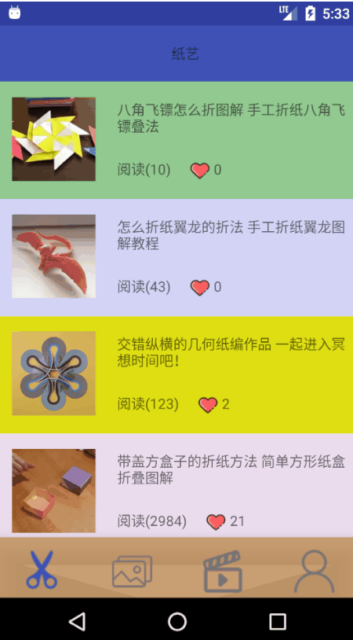
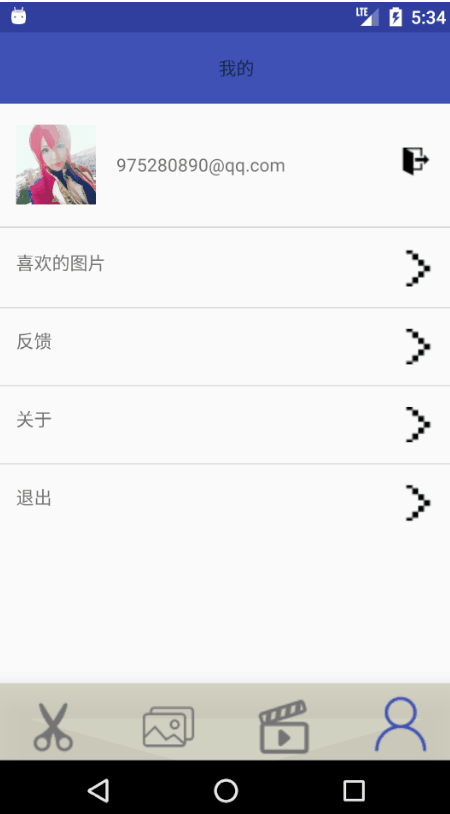

# MyMusic

这是一个简单的android音乐播放器

## 截图
 
## 使用到的框架
- 网络：retrofit2，okhttp3
- 图片：Glide
- 列表：XRecyclerview
## 使用到的知识点
- 页面：Activity，Fragment，ViewPager
- 列表：Recyclerview
- html显示：jsoup，html.forHtml
- 菜单：Popupmenu
- 广播：BroadcastReceiver
- 数据存储：bmob
## 实现的功能
- 手工艺知识列表展示，解析html详情页并展示
- 视频列表展示，webView实现视频播放页
- 图片瀑布流展示，并实现了收藏，下载
- 借助bmob实现了用户登录模块
- 头像的选择与裁剪
## 关于我
- 邮箱：<fairyland-cat@foxmail.com>
- 简书：<http://www.jianshu.com/u/18a99f29b0ca>

## 声明
- 数据来源于干货集中营与手艺活网，仅用于个人学习使用
- 实现的功能都比较简单，欢迎大家对不足处进行指教与交流
